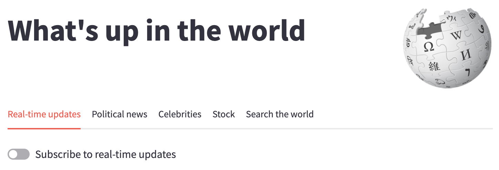
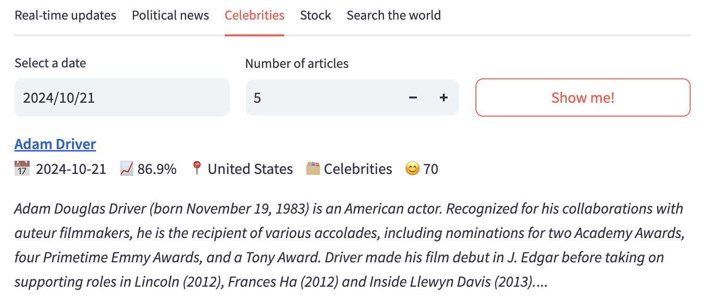
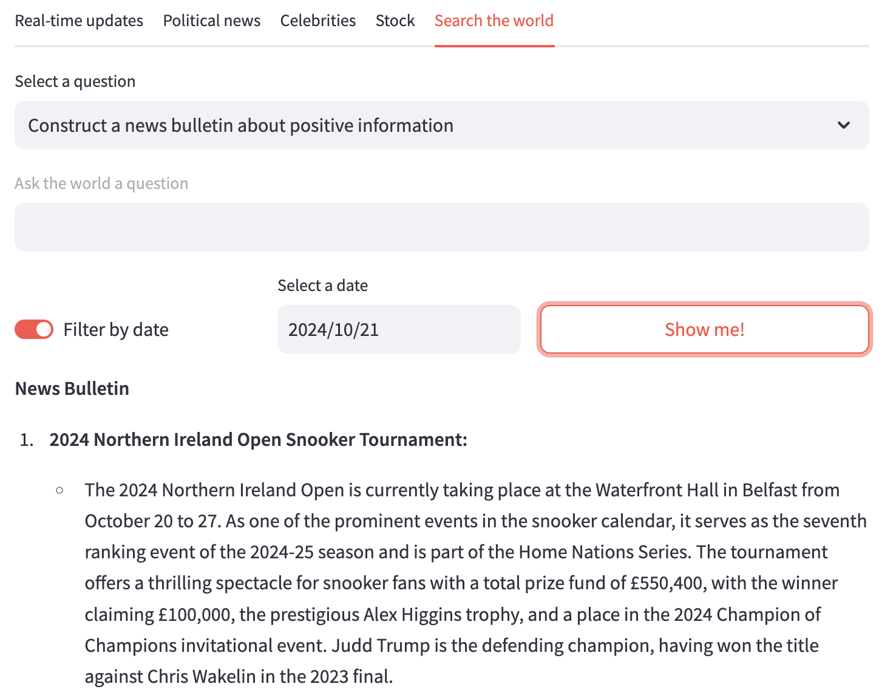
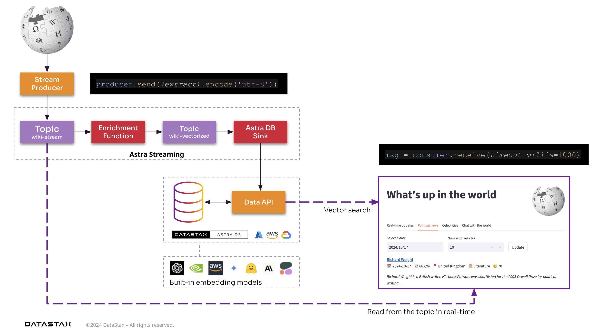
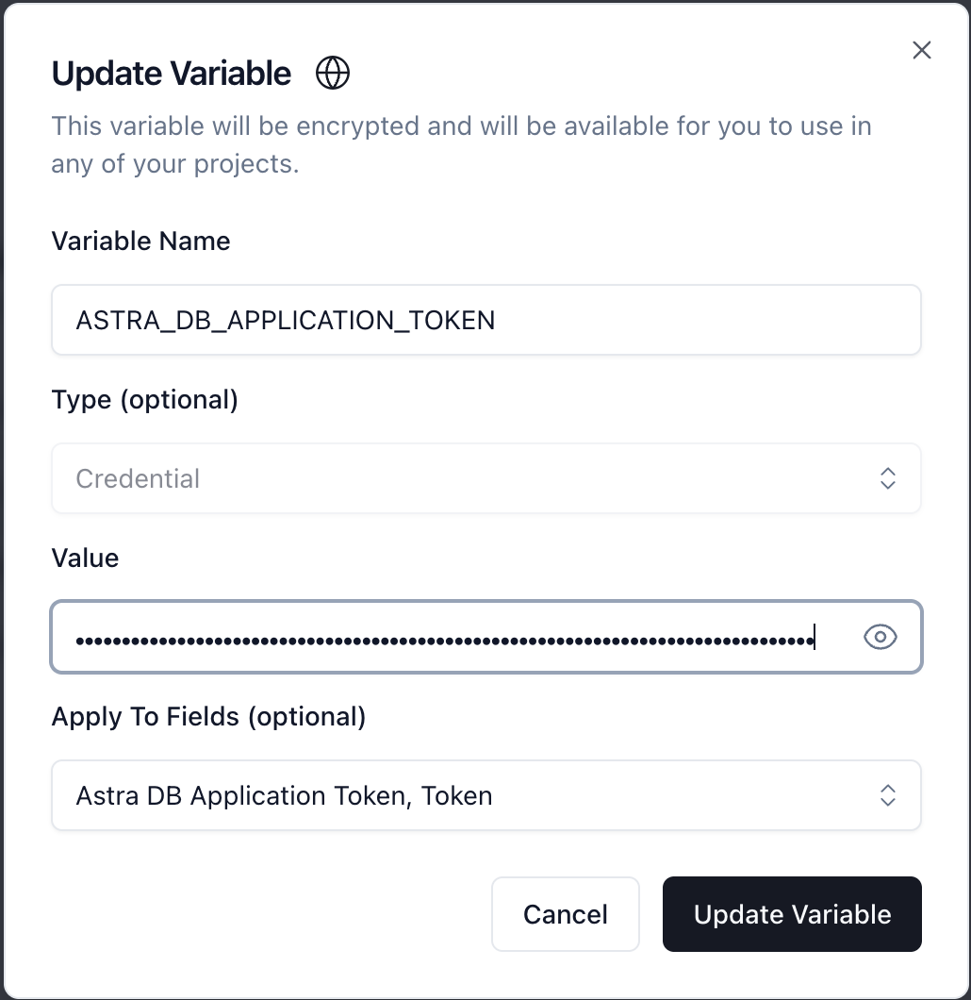

# Enterprise-grade real-time RAG pipeline on Wikipedia 🌎
This project is part of the following Github projects:
- [Wikipedia - What's up in the world? (Back-end)](https://github.com/michelderu/wikipedia-pulsar-cassandra)
- [Wikipedia - What's up in the world? (Front-end)](https://github.com/michelderu/wikipedia-langflow-streamlit) **(THIS PROJECT)**

## Introduction
Wikipedia is an amazing source of information 🧠. With all the real-time additions and updates of articles, it's a valuable source of information about what's happening in the world 🌍. Perhaps even faster than the news 📰. And that's what this project is all about: Accessing the most relevant articles from Wikipedia to answer your questions.

Additionally, this project is a good example of how to build a rock-solid, scalable, and performant enterprise architecture 🚀. It makes use of the following proven technologies:
- [Pulsar Streaming on DataStax Astra](https://www.datastax.com/products/datastax-astra-streaming): A fully managed Pulsar as a service that provides a real-time pub-sub messaging platform.
- [Cassandra Database on DataStax Astra](https://www.datastax.com/products/datastax-astra-db): A fully managed Cassandra DB w/ world-class Vector Search as a service.
- [Langchain on DataStax Astra](https://www.datastax.com/products/langflow): A no-code IDE for building RAG pipelines and GenAI applications.
- [Streamlit](https://streamlit.io/): A Python library for prototyping web apps.

🤩 Notable concepts used in this project are:
- Back-end ⏪
    - Publishing Wikipedia updates in real-time to a Pulsar Topic - Fire and forget with delivery guarantees.
    - [Pulsar Functions](https://pulsar.apache.org/docs/functions-overview/): Enriching the data and JSON structure of the Wikipedia articles.
    - Using a Pulsar Sink (function) to store the data in Astra DB using the Data API.
- Front-end ⏩
    - Langflow
        - A simple flow to read any web page, extract the content, chunk it up, and store it in Astra DB inclduing the embeddings to enable Vector Search.
        - A simple RAG flow for a Conversational Interface with Wikipedia.
        - A REST endpoint to access the RAG pipeline for easy integration into any front-end
    - Streamlit
        - Using -just- Vector Search to classify data into news topics in real-time with no lag.
        - Using [Instructor](https://github.com/jxnl/instructor) + an LLM to enrich the data further including Sentiment Analysis.
        - Subscribing to the Pulsar Topic showing real-time Wikipedia updates flowing in.
        - [Astra Vector DB](https://docs.datastax.com/en/astra-db-serverless/get-started/concepts.html): A [Forrester Wave Leader](https://www.datastax.com/blog/forrester-wave-names-datastax-leader-vector-databases) in the Vector Database category.
        - [Astra Vectorize](https://docs.datastax.com/en/astra-db-serverless/databases/embedding-generation.html): Auto-generate embeddings with vectorize.
        - Providing a Chat with Wikipedia using an LLM.
        - Providing a Q&A interface with Wikipedia using the Langflow REST API.

## Why is real-time streaming so important?
A lot of people are struggling to make the leap from RAG prototyping to production hardened RAG pipelines. Streaming solves that.
> Streaming provides a no-more-sleepness-nights fire-and-forget way of updating your data, with guarantees for delivery.

Additionally, it fully decouples apps and backbones which still keep working if one or the other is temporarily unavailable.

## Screenshots




## The architecture
This application is the back-end for the Wikipedia - What's up in the world? project. It consists of two parts:
1. A [Pulsar Streaming project](https://github.com/michelderu/wikipedia-pulsar-cassandra) that consists of the following components:
    - A Pulsar producer that produces the Wikipedia articles to a Pulsar topic.
    - A Pulsar function that enriches the Wikipedia articles with and OpenAI LLM.
    - A Pulsar sink that stores the enriched Wikipedia articles in an Astra DB collection.
2. A [Front-end with Langflow and Streamlit](https://github.com/michelderu/wikipedia-langchain-streamlit) **(THIS PROJECT)** that allows you to search the Wikipedia articles and chat with the articles.



## How to run Langflow

### Configuration
This assumes you have already created an Astra DB account, a database and a Vectorize-enabled collection. See the steps [here](https://github.com/michelderu/wikipedia-pulsar-cassandra#preparations).


Browse to [Langflow](https://astra.datastax.com/langflow) and click on `Settings`. Create two new variables of type `credential`:
- ASTRA_DB_APPLICATION_TOKEN
- OPENAI_API_KEY

You can configure these variable to automatically be used in relevant fields in the components of Langflow as such:


### Create the flows
Click on the 🔽 icon in the top-middle, click `Import` and select the `langflow-ingest-rag-flows.json` file in this repository.

### Build the ingest flow
In the top flow, take the following steps:
1. Paste a URL (like https://en.wikipedia.org/wiki/Retrieval-augmented_generation) into the `URL` field.
2. Make sure that your OPENAI_API_KEY variable is set in the `OpenAI Embeddings` component.
3. Make sure that your ASTRA_DB_APPLICATION_TOKEN variable is set in the `Astra DB` component, the correct database and collection are selected.
4. Now press the ▶️ button on the `Astra DB` component.

### Check the results
Browse to [Astra DB](https://astra.datastax.com/databases), select your database and check that the collection has been updated with the new documents.

Additionally you can run a Semantic Search query like `What is RAG?` and see that the results are semantically similar to your question!

### Build the RAG flow
In the bottom flow, take the following steps:
1. Make sure that your OPENAI_API_KEY variable is set in the `OpenAI Embeddings` component.
2. Make sure that your ASTRA_DB_APPLICATION_TOKEN variable is set in the `Astra DB` component, the correct database and collection are selected.
3. Make sure that your OPENAI_API_KEY variable is set in the `OpenAI` component.
4. Press the ▶️ button on the `Chat Output` component
5. Now, click the `Playground` button on the bottom-left and see the chat interface in action!

### Get the REST API
You're now ready to use the RAG pipeline in your own projects!

To get the REST API, click on the `REST API` button on the bottom-left of the RAG flow and note down the URL for later use.

## How to run the Streamlit front-end

### Configuration
First you need to configure the `.streamlit/secrets.toml` file with the correct values. In order to do so, you need to:
- Copy the `secrets.toml.example` file to `secrets.toml`
- Enter the correct values for the variables
- You can use the values from the back-end project [Wikipedia - What's up in the world? (Back-end)](https://github.com/michelderu/wikipedia-pulsar-astra)

### Create a virtual environment
```bash
python -m venv .venv
source .venv/bin/activate
```
Or use your favorite IDE's built-in function to create a virtual environment.

### Install the dependencies
```bash
pip install -r requirements.txt
```

### Run the application
Be sure to have the back-end producing some articles before running the front-end.
```bash
streamlit run app.py
```

### Integrate with Langflow
You can use the Langflow RAG flow previously created to power the Streamlit application. To do so, paste the REST API URL into the repsective field on the `Chat with the World` tab.